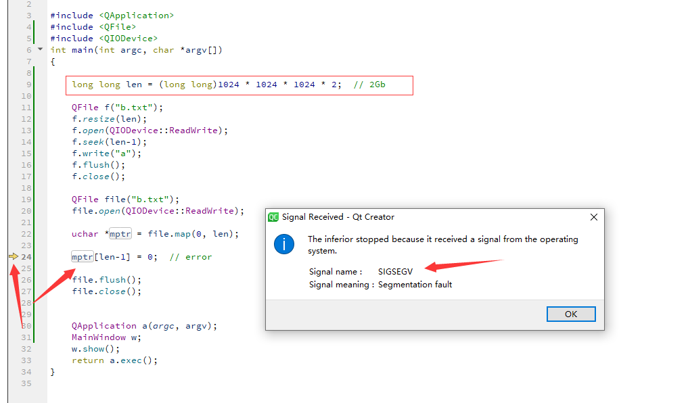
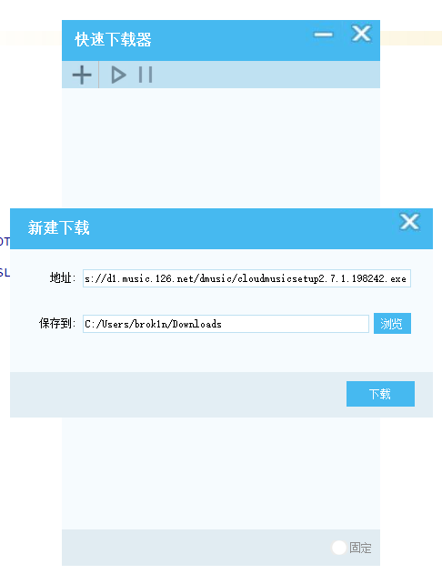

# 快速下载器  FastDownloader

因为 IDM 软件试用到期了，所以自己写一个来用。

目前主要功能实现了，但是遇到一个问题，下载超过1.5G的文件就会报错。我是用mmap来处理文件下载 

## 目前实现的功能：
1. 多线程同时下载一个文件
2. 多线程下载进度展示
3. 跟迅雷类似的监听复制到内存中的下载地址 自动弹下载框
4. 关闭程序默认最小化到托盘，可以在托盘中彻底退出程序
5. 本地化，目前只支持中文和英文 非中文系统语言都显示成英文

## 待解决问题
1. 超过1.5G文件报错。无法对超过1.5G的内存映射文件做 写 操作

## 待开发完善
1. 下载完成提示
2. 下载总进度显示
3. 下载完 通知栏弹消息
4. 待完善界面附加功能
5. 设置界面
6. 开机启动

## 现在的运行效果

#### 首页

#### 新建下载

#### 下载中

